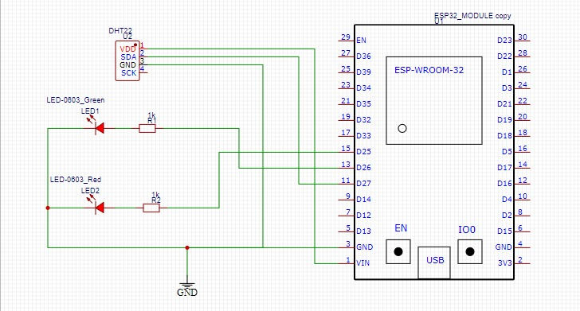
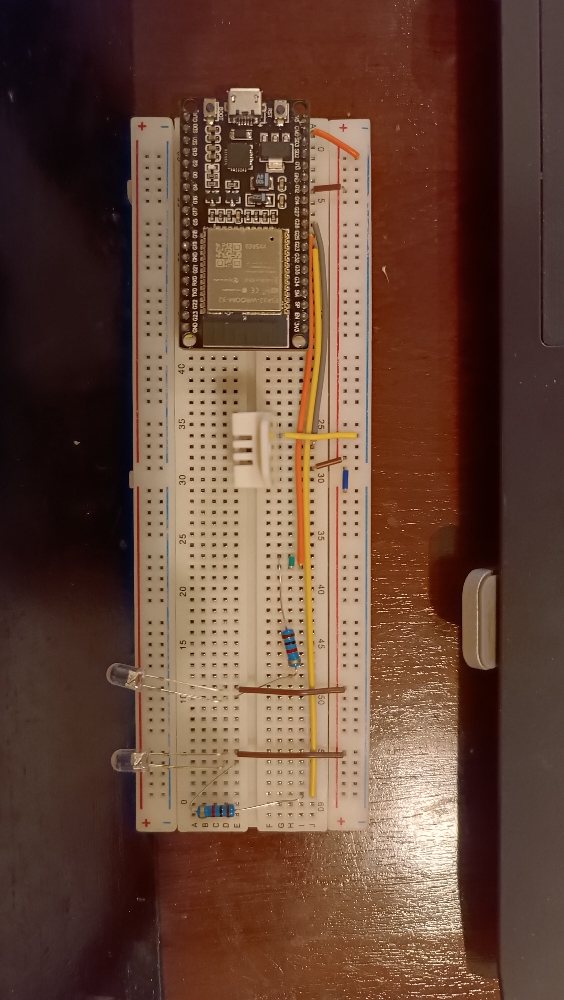

# Temperature Monitor Using ESP32 and DHT22. Connected to Telegram Bot

## **Description:**

This program allows you to monitor room temperature using a DHT22 sensor and send temperature reports via Telegram bot. It also controls red and green LEDs to indicate program status.

**Table of Contents**
- [Temperature Monitor Using ESP32 and DHT22. Connected to Telegram Bot](#temperature-monitor-using-esp32-and-dht22-connected-to-telegram-bot)
  - [**Description:**](#description)
  - [**Installation:**](#installation)
  - [**Libraries Used:**](#libraries-used)
  - [**Explanation:**](#explanation)
    - [**Circuit:**](#circuit)
    - [**Diagram \& photo:**](#diagram--photo)
    - [**Functions:**](#functions)
    - [**Example Use Cases:**](#example-use-cases)
  - [**Flowchart**](#flowchart)
  - [**FAQ:**](#faq)
  - [Future Update \& Bug Fix](#future-update--bug-fix)
  - [**License:**](#license)

## **Installation:**

1. Install Arduino IDE.
2. Install ESP32 Arduino core.
3. Clone this repository to your computer.
4. Open the program in Arduino IDE.
5. install these two libraries form Arduino Library Manager:
   - [UniversalTelegramBot](https://github.com/witnessmenow/Universal-Arduino-Telegram-Bot) by Brian Lough
   - [DHT sensor library](https://github.com/adafruit/DHT-sensor-library) by Adafruit
6. Replace the placeholder values for `BOT_TOKEN`, `CHAT_ID`, `WIFI_SSID`, and `WIFI_PASSWORD` in the code with your own values.
7. Compile the program to your ESP32.

## **Libraries Used:**

- `WiFi`: Used to connect ESP32 to WiFi network.
- `WiFiClientSecure`: Used to connect ESP32 to WiFi network with secure certificates.
- `UniversalTelegramBot`: Used to communicate with Telegram bot.
- `DHT`: Used to read data from DHT22 sensor.

## **Explanation:**

### **Circuit:**

- DHT22 sensor is connected to pin GPIO 27 of ESP32.
- Red LED is connected to pin GPIO 26 of ESP32.
- Green LED is connected to pin GPIO 25 of ESP32.

### **Diagram & photo:**

### **Functions:**

- **Monitor Temperature:**
  - Program reads temperature and humidity data from DHT22 sensor every 20 minutes (modifiable with `intervalTime` variable).
  - Temperature data is formatted and stored in variables.
  - Temperature data is sent to Telegram bot.
- **Control Lights:**
  - **Red LED:**
    - Blinks continuously: Searching/connecting to WiFi.
    - Turns on for 5 seconds: WiFi connected successfully.
    - Blinks once short: Temperature is read by the device.
    - Blinks twice short: Message sent to Telegram.
    - Blinks three times short: Message failed to send.
  - **Green LED:**
    - Blinks every 2 seconds: Indicates module is active and online.

### **Example Use Cases:**

- **Monitor room temperature remotely via Telegram bot.**
- **Get notifications when room temperature exceeds or falls below certain limits.**

## **Flowchart**
  Coming soon

## **FAQ:**

**Q: How to change the temperature reading interval?**

A: You can change the temperature reading interval by modifying the value of the `intervalTime` variable in the program code.

**Q: How to change the temperature limits for notifications?**

A: This feature is not currently implemented in the program. You would need to add additional code to set temperature limits and send notifications accordingly.

**Q: How to change LED colors?**

A: The program currently uses red and green LEDs. To change the colors, you would need to modify the `digitalWrite` function calls and the `LED_PIN_1` and `LED_PIN_2` definitions in the code.

**Conclusion:**

This program is a useful tool for monitoring room temperature using ESP32 and send report to telegram. LED is additional in this module. You can just only run it with ESP32 and DHT22 sensor only. LED just for signal if IoT module is works/no.

## Future Update & Bug Fix

- [ ] **Add temperature limits warning notifications**
- [ ] **Add two-ways interaction in telegram**
- [x] **Refactoring Code**
- [ ] **Add response when sensor is fail to read**
- [x] **Fix green LED behavior**
- [x] **Add wiring diagram**
- [x] **Add Wokwi Diagram**

## **License:**

This project is licensed under the GNU GENERAL PUBLIC LICENSE - see the [LICENSE.md](LICENSE.md) file for details.
